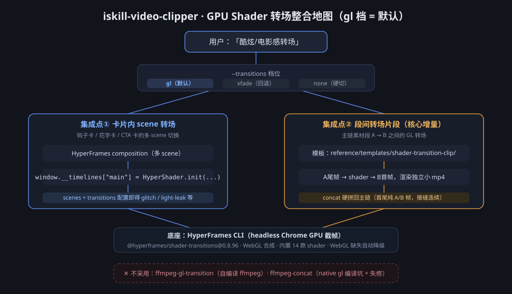
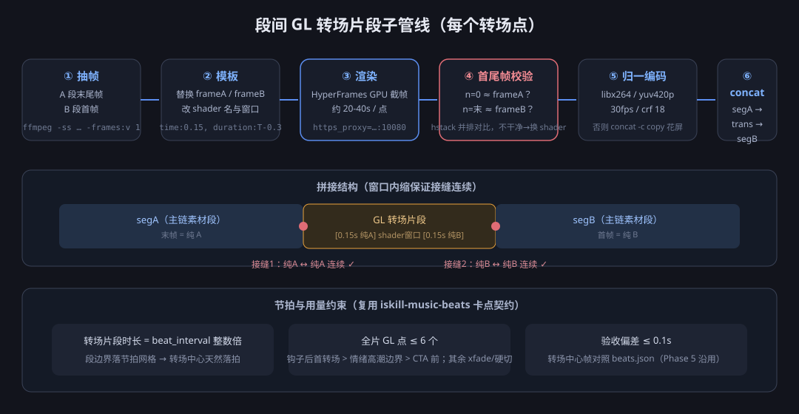

# GPU Shader 转场契约（gl 档，默认）

> 2026-09-30 PoC 全通：卡片内转场（transitions-demo）+ 段间转场片段（transition-clip）+ concat 接缝帧校验。
> 用户决策：**gl 档为默认**（xfade 视觉不够理想，降级为回退）；xfade 公式保留见 SKILL.md ③。

## 0. 架构总览



- 左路（集成点①）管**卡片内部**的 scene 切换，右路（集成点②）管**主链素材段之间**的转场，两者共用同一 HyperFrames 渲染底座，互不干扰
- 段间转场片段的六步子管线与节拍约束见下图 / 第 3、4 节：



## 1. 技术底座（已验证）

- **渲染器**：HyperFrames CLI（`npx --yes hyperframes@0.8.96 render`，headless Chrome GPU 截帧，10s@30fps ≈ 33s）
- **shader 库**：`@hyperframes/shader-transitions@0.8.96`（IIFE 全局名 `HyperShader`，已本地化进模板 assets/）
- **效果清单**（内置 14 款）：`glitch`（数字故障）、`light-leak`（暖光晕）、`cinematic-zoom`（径向变焦+色差）、`domain-warp`（熔岩扭曲）、`chromatic-split`（RGB 分离）、`swirl-vortex`（螺旋）、`whip-pan`（快甩）、`sdf-iris`（圆形虹膜）、`ripple-waves`（涟漪）、`gravitational-lens`（引力透镜）、`thermal-distortion`（热浪）、`ridged-burn`（燃烧）、`cross-warp-morph`（噪声 morph）、`flash-through-white`（白闪）
- **不采用**：ffmpeg-gl-transition（需自编译 ffmpeg）、ffmpeg-concat（native gl 编译坑+失修）

## 2. 集成点①：卡片内 scene 转场（钩子/花字/CTA 卡）

卡片 composition 多 scene 时的 scene 切换用 shader，不再手写 opacity 交叉：

```js
window.__timelines = window.__timelines || {};
// 关键：init() 不会自己注册时间线，必须手动挂到 window.__timelines["<compositionId>"]
window.__timelines["main"] = HyperShader.init({
  bgColor: "#0d0d13",          // 与卡片背景一致
  accentColor: "#ff3e8f",      // shader 泛光强调色，与卡片主色一致
  scenes: ["s1", "s2", "s3"],  // scene 元素 id，按顺序；显隐由 lib 管理
  transitions: [
    { time: 3.0, shader: "glitch", duration: 0.8 },      // 转场窗口 3.0-3.8s
    { time: 6.2, shader: "light-leak", duration: 0.8 },
  ],
  timeline: tl,   // 内容动画照常写在 tl 上（from/to 均可），lib 会捕获动画后的场景样本
});
```

- 内容动画时间要避开转场窗口（窗口内该 scene 的动画应已结束/未开始）
- 场景显隐由 lib 接管，**不要**再写 scene 间的 opacity 交叉 tween
- WebGL 不可用时 lib 自动降级为普通播放（不炸渲染）

## 3. 集成点②：段间转场片段（主链素材段之间）

**结构**：转场本身渲染成独立小 mp4（A尾帧 → shader → B首帧），concat 硬拼回主链。

**为什么硬拼可行**：shader 转场窗口内缩后，片段首尾帧=纯 A 帧/纯 B 帧，与相邻段首尾帧连续。

**流程**（每转场点）：

```
1. 抽帧  ffmpeg -ss <A段末-0.05> -i segA.mp4 -frames:v 1 frameA.png
         ffmpeg -ss 0 -i segB.mp4 -frames:v 1 frameB.png      （B 首帧取 t=0.05 处亦可）
2. 模板  复制 reference/templates/shader-transition-clip/ → 工作目录，替换 frameA/frameB，
         改 data-duration=T、shader 名、窗口参数（time:0.15, duration:T-0.3）
3. 渲染  npm run render  （需代理：export https_proxy=http://127.0.0.1:10080）
4. 校验  抽片段 n=0 与 n=末帧，与 frameA/frameB 并排对比（hstack），首尾必须干净
5. 归一  ffmpeg -i trans.mp4 -vf "fps=30,scale=1080:1920,format=yuv420p" -c:v libx264 -crf 18 trans_norm.mp4
         （与相邻段统一编码参数，concat -c copy 才不花屏）
6. 拼接  写进 concat list：segA → trans_norm → segB …
```

**模板**：`reference/templates/shader-transition-clip/`（index.html + package.json + 本地化 assets，`frameA.png`/`frameB.png` 需自放）。

## 4. 节拍契约（卡点不变）

- 无 BGM：转场片段时长 1.2~2s
- 有 BGM：**转场片段时长 = beat_interval 整数倍**；段边界全部落在节拍网格上时，转场中心（=拼接点 + Tseg/2）天然落拍
- 转场点标注规则：**全片 ≤6 个 GL 点**（每个约 20-40s 渲染成本），优先级：【钩子】结束后第一个转场 > 情绪高潮段边界 > CTA 前最后转场；其余转场点回退 xfade 或硬切
- 验收（Phase 5）沿用：转场中心帧对照 beats.json，偏差 ≤0.1s

## 5. 档位与回退

| 档位 | 触发 | 说明 |
|---|---|---|
| `--transitions gl` | **默认** | 用户没点名转场方式即用 gl；「酷炫转场/电影感/特效转场」均指此档 |
| `--transitions xfade` | 回退 | 无 Chrome/WebGL、用户点名「快速出片/省时间」、GL 渲染重试 1 次仍失败 |
| `--transitions none` | 硬切 | 用户点名 |

- gl 渲染失败重试 1 次仍失败 → 该点降级 xfade 并在交付信息注明，**不要整体打回**
- 剪映草稿模式（Phase 7）不受影响：仍用 `add_transition_simple`（剪映自带转场）

## 6. 已知坑（实测）

1. **init() 不注册时间线**：必须手动 `window.__timelines["main"] = HyperShader.init(...)`，否则渲染器等 45s 超时后按静态帧渲染（画面只剩 h2 类静态元素）
2. **shader 端点残留**：domain-warp 在 progress=1 有黑色缺口 → 窗口内缩 0.15s（time:0.15/duration:T-0.3）规避；新增 shader 首次使用都要做首尾帧校验
3. **渲染需代理**：npx 拉包/字体走 `https_proxy=http://127.0.0.1:10080`；assets 已本地化后页面本身离线可渲染
4. **file:// 下 @font-face 被 CORS 拦**：转场片段模板不带字体，若要在片段内叠字，走本地 HTTP 服务或 base64 内联
5. **concat 必须 -c copy 前归一编码**：三段统一 libx264/yuv420p/30fps/crf，否则花屏或时长异常
